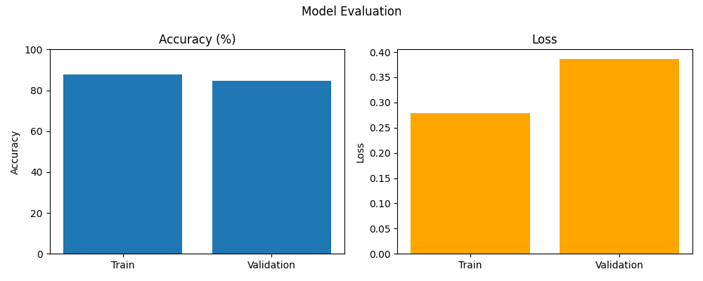

# CatsVsDogs
🐱🐶 Cats vs Dogs Classifier
A Convolutional Neural Network (CNN)-based binary image classifier trained to distinguish between two classes: cats and dogs.

The model achieves a training accuracy of 87.88% and a validation accuracy of 84.50%, making it a solid baseline for binary image classification tasks. It was trained using TensorFlow and Keras on a labeled image dataset of cats and dogs.

Model Evaluation

Features

CNN architecture with Conv2D, MaxPooling, Dropout, and Dense layers

Binary classification using sigmoid activation

Dataset organized into training_set and test_set directories

Evaluation visualization (accuracy and loss plots)
